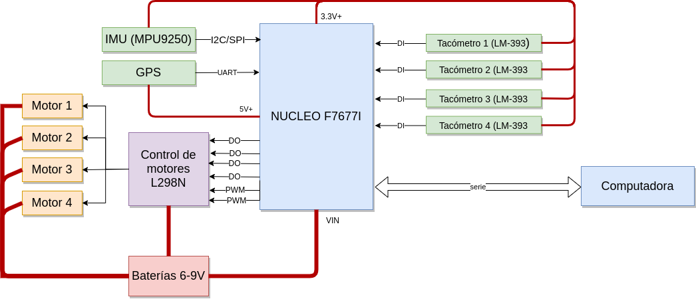
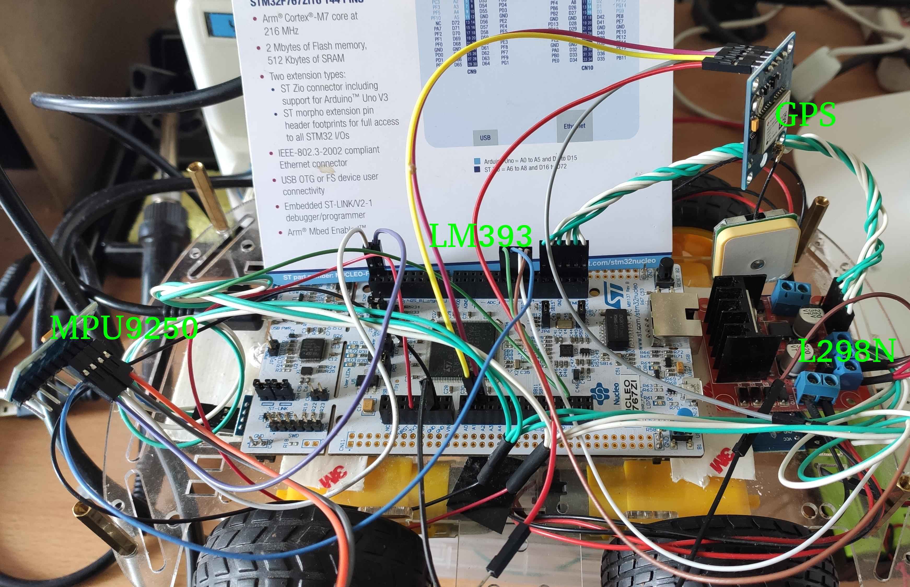
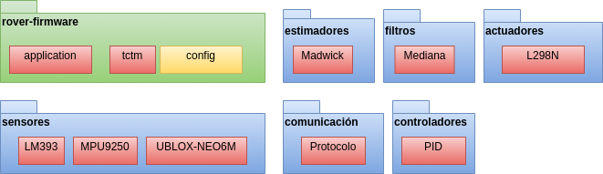
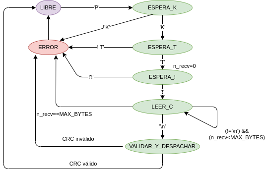
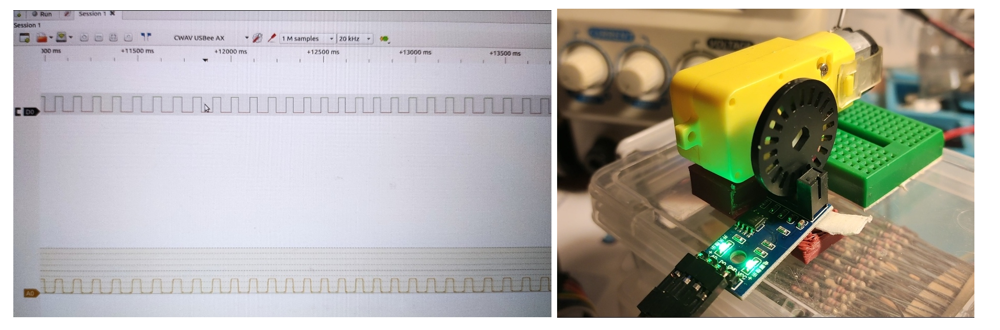
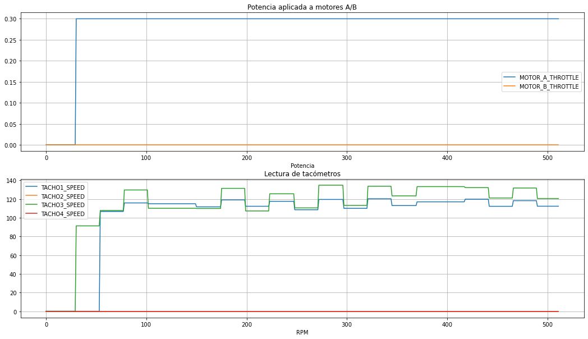
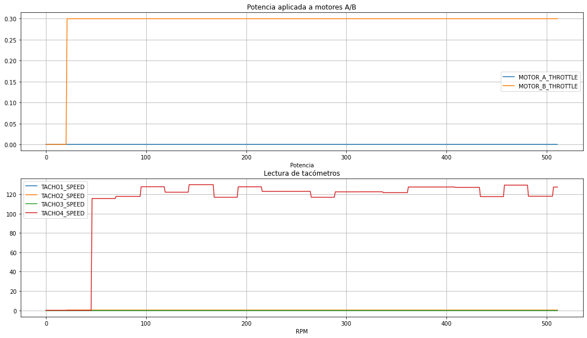
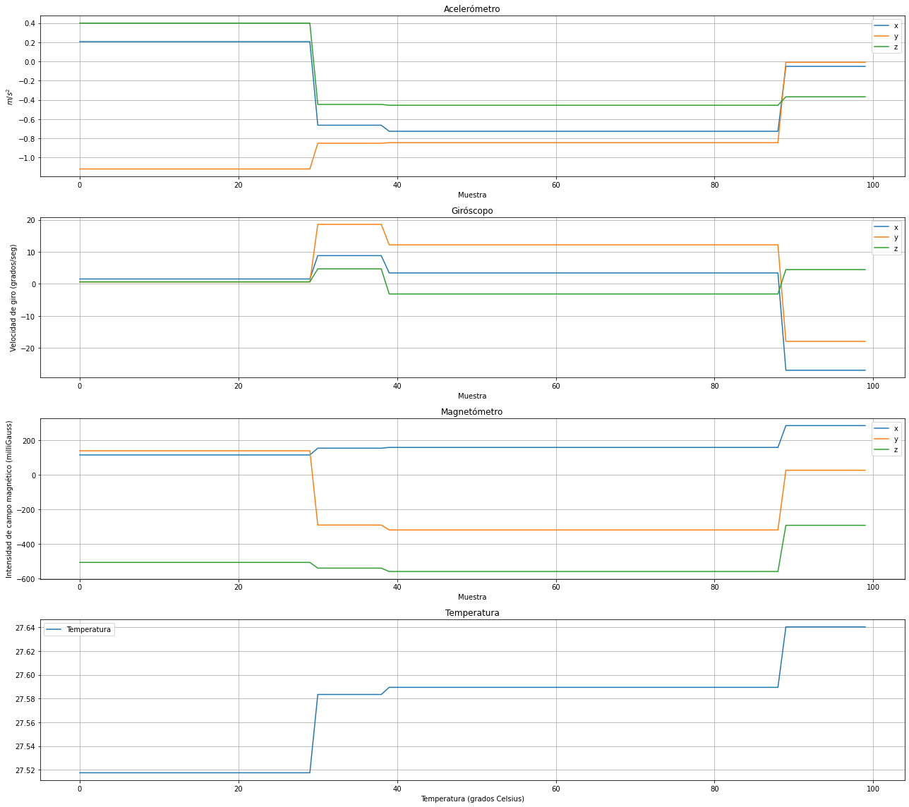

[TOC]

# Introducción

Este documento describe el diseño e implementación del firmware de la placa de control de un vehículo de operación remota (generalmente llamado ROVER por sus siglas en inglés: *Remotely Operated Vehicle for Emplacement & Reconnaissance*). El desarrollo se hizo en C++ utilizando MBedOS para la placa Nucleo-144 STM32F767ZI.

## Marco de la propuesta y motivación

El presente trabajo es parte de un proyecto de mayor alcance en el que la placa de control del vehículo es  uno de los subsistemas a desarrollar.  El objetivo final del proyecto es contar con una plataforma para:

- Aprendizaje y prototipado de aplicaciones en el ambiente [ROS (Robot Operative System)](https://www.ros.org/) 
- Aprendizaje y prototipado de aplicaciones de visión artificial.
- Experimentación con formas de navegación autónoma usando inteligencia artificial, comenzando por la detección de objetos en una escena e incorporando gradualmente otros sensores y técnicas que pueden incluir SLAM y filtros de partículas, entre otros.
- Prototipado de aplicaciones IoT en las que se colecta algún tipo de información y se registra en bases de datos.

Se espera que, con excepción del firmware, el software desarrollado sea válido tanto para un ROVER real  como para un modelo simulado (por ejemplo en [Gazebo](http://gazebosim.org/), [Webots](https://cyberbotics.com/) o [V-Rep](https://www.coppeliarobotics.com/)). 

En el siguiente diagrama se muestra el sistema completo para el que antes de realizar este trabajo se se habia realizado una implementación preliminar del firmware en una placa arduino. También se utilizó una Raspberry Pi 3B+ para ensayar la conexión serie con la placa de control.


 

Se adopta una arquitectura típica para este tipo de sistemas, en la que como mínimo se dispone del vehículo y un software para operarlo desde una computadora externa a la que se llama *ground station*. La placa controladora cumple las funciones mínimas de control, mientras que una aplicación que se ejecuta en un microprocesador ejecuta aquellas de alto nivel (por ejemplo, con ROS). En el diagrama se muestra además un servidor en el que se realiza detección de objetos, procesamiento de imagen y registro en bases de datos (ElasticSearch).  

## Plataforma y carga útil

Se utiliza el término **plataforma** para referirse al vehículo físico, placa de control y sensores y actuadores necesarios para su control y **carga útil** para refererirse a la computadora y otros sensores e instrumentos adicionales que permitan al vehículo cumplir una **misión**, como por ejemplo obtener mediciones, manipular un brazo u otro mecanismo, explorar de forma autónoma y transmitir video. 

Esta división es habitual en este tipo de aplicaciones y tiene como objetivo separar las funciones mínimas que debe cumplir un robot teleoperado de aquellas más específicas del uso que se le quiere dar, permitiendo reutilizar el hardware y software de una misma plataforma en diferentes misiones. La frontera de qué tareas relevar en la plataforma y cuales en la carga útil es una decisión de diseño.

A modo de ejemplo: si se trata de un drone se espera que la plataforma proporcione la capacidad de desplazar el vehículo, mantenerlo estabilizado y exponer su posición, actitud y velocidad  pero no necesariamente esquivar obstáculos o definir una trayectoria.

Del mismo modo, se espera que un vehículo terrestre pueda ser comandado para avanzar a una velocidad determinada, detenerse, o cambiar su orientación, pero la planificación de trayectorias u otras tareas más complejas puede ser delegada en un subsistema de más alto nivel.

El ROVER de este trabajo por ser una plataforma para fines didácticos y de aprendizaje, debe permitir integrarse con múltiples sensores, actuadores, instrumentos y por lo tanto debe permitir modificar y extender sus comandos y telemetrías, algoritmos de control, y otras funciones.

# Diseño e implementación

A continuación se describe el hardware utilizado en este trabajo para la plataforma y la carga útil.

**Plataforma**

- Microcontrolador (placa [NUCLEO-F767ZI](https://www.st.com/en/evaluation-tools/nucleo-f767zi.html)) que implementa el lazo de control del vehículo y procesamiento de telecomandos y telemetrías.
- Sensores:
  - [4x tacómetros utilizando encoders ópticos LM393](https://candy-ho.com/producto/sensor-optico-horquilla-velocidad-tacometro-lm393-arduino/).
  - [1x MPU9250](https://articulo.mercadolibre.com.ar/MLA-618704275-mpu-9250-mpu9250-acelerometro-magnetometro-giroscopo-arduino-_JM#position=2&search_layout=grid&type=item&tracking_id=5be31c5c-a195-44a5-9254-faf2f07b738c).
  - [1x GPS Neo6M](https://articulo.mercadolibre.com.ar/MLA-684956175-neo6m-gy-gps6mv2-gps-apm25-neo-6m-modulo-antena-a0129-_JM#position=2&search_layout=grid&type=item&tracking_id=110a4426-ee0b-4a96-8a97-0db8e81b4a8f).
- Actuadores:
  - [Módulo controlador de motores L298N](https://candy-ho.com/producto/doble-puente-h-driver-l298n-motor-dc-arduino-arm-avr-l298/).

**Carga útil**

- Computadora [Raspberry Pi 3B+](https://articulo.mercadolibre.com.ar/MLA-905487539-raspberry-pi-3-b-microcentro-_JM#position=1&search_layout=grid&type=item&tracking_id=b91faaf8-6d0f-4403-9218-64f45a0c3a25) para las funciones de alto nivel, como por ejemplo el software aplicativo, la comunicación con estación de control (WIFI), transmisión de video, etc. Se utiliza en la etapa temprana de desarrollo como sustituto más económico de una computadora más apropiada para la tarea, como por ejemplo [NVIDIA Jetson](https://articulo.mercadolibre.com.ar/MLA-650445732-nvidia-jetson-tx1-development-kit-espectacular-a-pedido-_JM#position=24&search_layout=stack&type=item&tracking_id=0d5721d2-8004-4187-8632-154e602442e8).
  - Opcional: [adaptador wireless USB](https://articulo.mercadolibre.com.ar/MLA-821851223-adaptador-tp-link-wireless-archer-t2u-plus-ac600-_JM?matt_tool=28960764&matt_word=&matt_source=google&matt_campaign_id=11617319696&matt_ad_group_id=108457960970&matt_match_type=&matt_network=g&matt_device=c&matt_creative=479788905259&matt_keyword=&matt_ad_position=&matt_ad_type=pla&matt_merchant_id=114675143&matt_product_id=MLA821851223&matt_product_partition_id=300169103711&matt_target_id=aud-1250848972253:pla-300169103711&gclid=Cj0KCQjw9O6HBhCrARIsADx5qCRV5xhMd9srqBK5Z9eRFATgobgF0cxrIgKTIVSMb2nEiIrNwlCN8L4aAp5IEALw_wcB) para mejorar velocidad y rango de comunicación.
- Cámara USB: Logitech Webcam C170.

**Alimentación:**

- Se utilizan baterías 18650 para el microcontrolador y motores y una batería USB para la computadora.

Nota: para el chasis se utiliza el [kit 4WD](https://candy-ho.com/producto/chasis-kit-armar-robot-4wd-auto-motor-arduino-raspberry/) que incluye 4 motores DC c/ reducción y ruedas.

## Componentes de software

Puede hacerse una primera división del software entre el firmware y el código de aplicación. Para el trabajo final de este curso **únicamente se desarrolló el firmware**.

El código aplicativo está organizado siguiendo la filosofía de ROS de separar las aplicaciones y conectarlas en una red TCP/IP donde se publican y se suscriben a datos de interés mediante un sistema de mensajería. Esto permite construir aplicaciones complejas aprovechando la extensa cantidad de componentes disponibles para todo tipo de tareas: planificación de trayectoria, corrección de distorsión de cámara, fusión de datos, inteligencia artificial, etc. además de facilitar la integración prácticamente con cualquier otro software existente.

En el firmware no hay un mecanismo de publicación/subscripción, pero se mantiene la filosofía de separar los componentes por tipo de función y construir aplicaciones a partir de la instanciación y configuración de módulos existentes.

#### Firmware (NUCLEO F67ZI)

El firmware fue desarrollado en C++ para MbedOS 6 siguiendo estándares de programación de software embebido.

Tiene un modelo de ejecución de un único hilo con tareas periódicas que son invocadas desde un timer. Uno de los motivos de esta decisión de diseño es poder migrar a un modelo de ejecución multitarea más adelante.

El firmware implementa un lazo de sensado y control que comprende:

- Lectura de sensores: tacómetros con filtro de mediana,  actitud con MPU9250 y GPS (implementación sin terminar).
- Control de actuadores (motores) con PID.

- Estimación de cuaternion de actitud con algoritmo de Madwick.
- Comunicación:
  - Protocolo propio basado en mensajes (similar a MAVLINK)  con capa de transporte sobre UART.
  - Un conjunto de comandos básicos de control: establecer velocidad, obtener reportes, etc.
  - Telemetrías y reportes para aplicación ROVER con estado general del sistema, reportes de sensores, etc.

#### Código de aplicación

El código de aplicación está desarrollado en Python o C++ usando ROS para ejecutarse en Ubuntu en ARM o x86, dependiendo de la exigencia de la tarea.  Para este trabajo sólo se ramificó del aplicativo un cliente en python y se realizó un procedimiento de puesta en marcha (links a repositorios en sección correspondiente).

## Diagrama en bloques de la placa de control

El siguiente diagrama muestra los componentes del sistema:



- La lectura del sensor IMU se implementó por I2C, pero puede utilizarse también SPI.
- La lectura del GPS se realiza por UART.
- Los tacómetros se conectan a pines de entrada digitales. Observación: en el diseño original se contempló el uso de capacitores para reducir el ruido en la lectura, pero los ensayos de banco con un analizador lógico demostraron que la señal no tenía ruido, por lo que fueron omitidos.
- El control de los motores se realiza por salidas pulsadas de ancho modulado (PWM) y un lazo PID que utiliza como retroalimentación la lectura de los tacómetros, pudiendo seleccionar en tiempo de compilación si se realiza un promedio del par de motores o se utiliza el que tenga el valor mínimo.

**Alimentación:** se utilizan dos baterías 18650 (8.4V) para alimentar el controlador de los motores, los motores y la placa. Para los sensores se utiliza la tensión de entrada recomendada en el datasheet de cada sensor mediante las salidas de la placa NUCLEO (3.3V o 5V).

## Conexionado de hardware

Se indican las conexiones y se indican los colores de los cables para facilitar la interpretación y corroboración de los procedimientos de puesta en marcha en las fotos (los enlaces a video se incluyen en la sección de ejemplos). También se incluyen los diagramas y referencias originales de la página del fabricante para facilitar la consulta.

En la fotografía a continuación se muestran todos los componentes conectados, con excepción de que el MPU9250 y GPS no están alimentados (en las pruebas se ensaya de a uno por vez).




### Referencia de conectores de placa Nucleo-144 F767ZI

Conectores CN7 y CN10


Conectores CN8 y CN9


Leyenda.


### Tablas de conexionado

#### NUCLEO - L298N

| Pin L298N | Pin Nucleo   | Color de cable |
| --------- | ------------ | -------------- |
| ENA       | PB_11 (CN10) | Blanco         |
| IN1       | PB_10 (CN10) | Verde          |
| IN2       | PE_15 (CN10) | Blanco         |
| IN3       | PE_14 (CN10) | Verde.         |
| IN4       | PE_12 (CN10) | Blanco         |
| ENB       | PE_10 (CN10) | Verde          |

#### L298N - Motores

| Pin L298N | Motor      | Color de cable |
| --------- | ---------- | -------------- |
| OUT1      | LF, LB (-) | Negro          |
| OUT2      | LF, LB (+) | Rojo           |
| OUT3      | RF,RB(+)   | Rojo           |
| OUT4      | RF,RB(-)   | Negro          |

Nota: con el vehículo apuntando hacia adelante: LF=Left/Front, RB=Right/Back,etc.

#### NUCLEO - MPU9250

| Pin NUCLEO           | Pin MPU9250 | Color de cable |      |
| -------------------- | ----------- | -------------- | ---- |
| 3.3V                 | 3.3V        | Naranja        |      |
| GND                  | GND         | Gris           |      |
| I2C_SDA (PB_9 - CN7) | SDA         | Violeta        |      |
| I2C_SCL (PB_8- CN7)  | SCL         | Blanco         |      |

#### NUCLEO - GPS

| Pin NUCLEO             | Pin GPS | Color de cable |
| ---------------------- | ------- | -------------- |
| 5V                     | VCC     | Rojo           |
| GND                    | GND     | Gris           |
| UART 2 Rx (PD_6 - CN9) | Tx      | Amarillo       |
| UART 2 Tx (PD_5 - CN9) | Rx      | Fucsia         |

#### NUCLEO - Tacómetros LM393

| Pin Nucleo    | Pin LM393            | Color de cable |
| ------------- | -------------------- | -------------- |
| GND           | GND                  |                |
| 3.3V          | VCC                  |                |
| PE_7 (CN-10)  | DO (Tacómetro 1, LF) | Marrón         |
| PE_8 (CN-10)  | DO (Tacómetro 2, RF) | Blanco         |
| PG_9 (CN-10)  | DO (Tacómetro 3, LB) | Azul           |
| PG_14 (CN-10) | DO (Tacómetro 4, LF) | Verde          |

## Arquitectura estática

La arquitectura estática describe el diseño de las clases y como fueron agrupadas según su función.

### Concepto de aplicación teleoperada

El ROVER adopta un modelo de diseño que es aplicable a cualquier sistema teleoperado. Una aplicación teleoperada define un protocolo que establece una forma de recibir comandos y una forma de publicar telemetrías de estado.

Este protocolo puede ser independiente de la capa de transporte, definiendo como deben formarse los paquetes y pudiendo estos paquetes transmitirse por CANBus, SPI, I2C, TCP/IP o lo que resulte conveniente en cada caso. 

El fragmento de código a continuación muestra como se instancia la aplicación del ROVER. Se heredan las clases `protocol::packet_decoder` y  `protocol::packet_encoder` porque la aplicación debe tener la capacidad de decodificar paquetes  que recibe que contienen telecomandos, y codificar paquetes que contienen reportes de telemetría para enviarlos. 

```c++
/** Clase aplicación. 
 * Notar que se heredan el codificador y decodificador de paquetes, es decir, 
 * la aplicación tiene la capacidad de generar paquetes y de decodificarlos.
*/
class application: 
	public protocol::packet_decoder,
	public protocol::packet_encoder	
{
public:    
    /** Constructor por defecto. */
	application();

    /** Destructor por defecto. */
    ~application() = default; 

    /** Inicialización. Incluye configuración de periféricos, tests iniciales, etc. */
	void setup();
    
private:
    /* Tabla de telemetrías */
	uint8_t tmy[TMY_PARAM_LAST]; // __attribute__((aligned (4)));	
	using opcode_callback = application::error_code(application::*)(const uint8_t* payload, uint8_t n);
/* ... */
```

Las clases `protocol::packet_decoder` y  `protocol::packet_encoder`facilitan la creación e interpretación de paquetes que contienen datos, pero dejan al usuario el definir su contenido. Están diseñadas para poder escribir rápidamente cualquier aplicación teleoperada.

### Organización del software

El software del ROVER está organizado como una biblioteca de componentes reutilizables en su mayor parte clases de C++, agrupadas por categorías para comunicación, filtros, algoritmos de estimación, sensores y actuadores.

Una aplicación se construye instanciando y configurando estos componentes, y por tratarse de una aplicación teleoperada, definiendo los telecomandos específicos y el formato en que expondrá su estado, es decir sus telemetrías. Una aplicación además especifica la forma en que se configurarán estos componentes, que consiste en establecer períodos de ejecución de cada tarea, asignación de pines, tamaños de buffer, etc.



A continuación se describe el criterio de definición de paquetes y los componentes implementados en la versión actual:

- **Sensores**: configuración y lectura de sensores. Actualmente incluye tacómetros LM393, IMU con MPU9250 (giróscopo, magnetómetro, acelerómetro y termómetro), y GPS con UBLOX-NEO6M.
- **Actuadores**: configuración y control de motores. Actualmente incluye el control de doble puente H con el módulo L298N.
- **Estimadores**: la lectura de sensores aislados en la mayoría de los casos es insuficiente para obtener una medición que represente el estado actual, por lo que por lo general estos sistemas necesitan estimar el estado a partir de la fusión de múltiples sensores. Esto puede incluir filtros de histograma, Kalman, Mahoney o el filtro de Madwick, éste último muy utilizado en drones porque permite tener resultados iguales o superiores a Kalman con requerimientos de cómputo más bajos. Se incluye el filtro de Madwick para estimar el cuaternión de orientación.
- **Controladores**: en muchos casos, como el de motores, calentadores, u otros dispositivos el control se hace a través a través de una señal que no coincide con la salida esperada del sistema (por ejemplo la velocidad de un auto se controla pisando un pedal que regula la cantidad de combustible suministrado). La intensidad de esta señal, por lo tanto, debe ajustarse hasta alcanzar la salida esperada en un lazo de control retroalimentado. Uno de los algoritmos más simples y efectivos para realizar esto es PID (por sus siglas en inglés *Proportional Integrative Derivative*). En el ROVER se utiliza para implementar un lazo de control con los tácometros.
- **Filtros**: las lecturas de los sensores pueden tener errores de distinto tipo. Algunos errores son fáciles de detectar porque se alejan del rango válido, otros errores ocurren en determinadas bandas de frecuencia, y en otros casos pueden ser más dificiles de identificar. Se incluye un filtro de mediana para tratar el primer caso.

## Arquitectura dinámica

La arquitectura dinámica describe como interactúan los componentes en el tiempo y describe aspectos como sincronización y colaboración entre los mismos.

### Protocolo de comunicación 

Para comunicarse con la computadora, se utiliza un protocolo de software basado en mensajes, donde cada paquete tiene el siguiente formato:

```
"PKT!<payload><crc16>\n"
```

siendo:

- "PKT!" la palabra de sincronismo (4bytes).
- *payload* es el la carga útil del paquete, una secuencia de un máximo de 64 bytes.
- *crc16* es el código CRC del payload.
- *\n* es el byte terminador del paquete.

Se definen dos tipos de paquetes:

- **Comandos**: la carga útil se compone de un byte indicando un código de operación (OPCODE)  seguido de datos específicos del comando.
- **Reportes**: la carga útil consiste en un byte indicando un código de reporte (REPORT_ID) seguido de datos específicos de cada reporte. Es mandatoria la implementación como mínimo de dos tipos de reporte:
  - Telemetría.
  - Resultado de ejecución de un comando.

El siguiente diagrama muestra la máquina de estados que se utiliza para reconocer el protocolo.



Secuencia nominal:

1. El estado inicial es *LIBRE* (es decir, se está a la espera de iniciar la recepción de un paquete).
2. Ante la llegada de un nuevo caracter, si el mismo coincide con el esperado para la secuencia de sincronismo se avanza al siguiente estado.
3. Una vez reconocido el último caracter de la secuencia de sincronismo se inicializa en cero  un contador de bytes leidos *n_recv* y se pasa al estado de recepción de bytes *LEER_C*.
4. En el estado *LEER_C* cada nuevo byte recibido se almacena en un buffer y se incrementa *n_recv*. El máximo es *MAX_BYTES*=64.
5. Se sale de *LEER_C* si se recibe el caracter terminador. En este caso se pasa al estado de *VALIDAR_Y_DESPACHAR*.
6. En el estado de validación se realiza el chequeo de CRC, y si es válido se despacha el paquete (es decir, se ejecuta la función asociada a ese OPCODE). De lo contrario se pasa a *ERROR* con el código *CRC_INVÁLIDO*.

Error:

1. Recibir un caracter inesperado, superar la cantidad máxima de bytes de un paquete o un error en CRC llevará al estado de error. En este estado se incrementará el contador del tipo de error y se transicionará al estado inicial.

### Definición y ejecución de comandos

Una aplicación debe explicitar los telecomandos que implementa en un arreglo, quedando cada telecomando definido a partir de:

- Un código de operación (OPCODE). Se comienza a contar desde 0x80 y este valor se resta al acceder a la tabla.
- Una función miembro de la clase de la aplicación que es llamada cuando se recibe ese comando.
- Opcionalmente, el telecomando puede contener parámetros, en cuyo caso la aplicación podrá leerlos accediendo al puntero del buffer conteniendo el paquete recibido. 
- Banderas indicando si el comando debe indicar su status de ejecución y actualizar contadores. Para comandos no críticos o que se envian periódicamente, puede ser aceptable que en algunos casos no sean procesados.

```c++
    /** Flags de un telecomando 
     *  Por defecto los telecomandos sólo se reciben y se procesan.
     *  Los flags permiten incrementar el contador de recibidos y/o generar un reporte conteniendo
     *  el estado de ejecución del comando.
     */
	enum opcode_flags {
		default_flags 				   	= 0x00, 
		update_execution_counters		= 0x01, /**< Actualizar contador de ejecución. */
		enable_execution_status_report 	= 0x02  /**< Generar un reporte de status. */
	};

	using opcode_callback = application::error_code(application::*)(const uint8_t* payload, uint8_t n);

    /** Descriptor de un OPCODE. */
	struct opcode_descr {
		opcode_callback fn;
		uint8_t flags;    
	};
```

El código a continuación muestra como la aplicación define sus comandos:

```c++
	opcodes
		{ 
			// Básicos
			{ &application::request_tmy, opcode_flags::default_flags },
			{ &application::led_on, opcode_flags::enable_execution_status_report },
			{ &application::led_off, opcode_flags::enable_execution_status_report },

			// BEGIN Comandos específicos de la aplicación
			// Control del rover
			{ &application::set_motor_throttles, opcode_flags::default_flags },
            { &application::set_motor_speed_setpoints, opcode_flags::default_flags },
            { &application::config_pid_controller, opcode_flags::default_flags }


			// END Comandos específicos de la aplicación
		}
```

Algunos comandos son genéricos y se utilizan en cualquier sistema para verificar que esté operativo, siendo el ejemplo típico el control de un LED y el pedido de un estado general y otros son específicos para cada aplicación.

Para cada comando se define una función que es llamada cuando se recibe un paquete válido cuyo código de operación (ver OPCODE en descripción de protocolo) coincide con el índice de la tabla (restando el 0x80 a partir del que se empiezan a contar). 

El ejemplo a continuación muestra el comando de configuración de los parámetros $k_p$,$k_d$, $k_i$ del controlador PID. 

```c++

application::error_code application::config_pid_controller(const uint8_t* payload, uint8_t n)
{
    float max = 1.0f;
    float min = -1.0f;
    float kp, kd, ki;    
    std::memcpy(&kp,&payload[0],4);
    std::memcpy(&kd,&payload[4],4);
    std::memcpy(&ki,&payload[8],4);
    this->motor_ctl.get_pid_controller(0).reset(max,min,kp,kd,ki);
    this->motor_ctl.get_pid_controller(1).reset(max,min,kp,kd,ki);
	return error_code::success;
}
```

### Definición y ejecución de tareas

El modelo de ejecución adoptado es de un único hilo

La aplicación define tareas que serán llamadas periódicamente con un intervalo configurable desde una instancia de objeto `Ticker`, y pudiendo indicarse si se ejecutan en una interrupción (ISR) o en el contexto de la aplicación. En este último caso, dado que `Ticker` ejecuta las llamadas por defecto en un contexto de interrupción, se utiliza una cola  `EventQueue`  configurada para despachar llamadas infinitamente al contexto de aplicación.

Nota: el contexto de ejecución de `EventQueue` queda capturado en el momento de inicialización de la aplicación.

```c++
 /* Definición de tareas períodicas */

    /** El ticker es el scheduler del sistema encargado de invocar a todas las funciones períodicas
     *  según la frecuencia que se haya configurado. Se usa 'task' para refereirse a estas tareas, si bien
     *  son funciones que se ejecutan un único hilo.
     */
    Ticker periodic_task_ticker;

    /** Cola utilizada para encolar funciones llamadas en una interrupción que requieren ser ejecutadas
     *  en contexto de la aplicación. 
     */
    EventQueue *task_ticker_queue;

    /** Definición de una tarea */
	struct periodic_task_entry {
		bool enabled; /**< Habilitación (se pueden deshabilitar para ensayos o para modo degradado) */
        
        /** Contexto de ejecución. Si puede ejecutarse en ISR (directo cuando se llama al ticker) o 
         * debe encolarse para que se ejecute en el contexto de la aplicación. */
        enum class execution_context{
            isr, 
            application
        } exec_ctx;

        /** Contador interno para scheduling. */
        uint32_t counter;	

        /** Período de la tarea (fijo, se calcula en la inicialización). */
		uint32_t period;

        /** Firma del entrypoint. */
		using periodic_task_entrypoint = void(application::*)();	
		periodic_task_entrypoint entrypoint;
	};
```

El fragmento de código a continuación muestra la tabla de definición de una tarea y los identificadores de tareas para esta aplicación.

```c++
    /** Definición de una tarea */
	struct periodic_task_entry {
		bool enabled; /**< Habilitación (se pueden deshabilitar para ensayos o para modo degradado) */
        
        /** Contexto de ejecución. Si puede ejecutarse en ISR (directo cuando se llama al ticker) o 
         * debe encolarse para que se ejecute en el contexto de la aplicación. */
        enum class execution_context{
            isr, 
            application
        } exec_ctx;

        /** Contador interno para scheduling. */
        uint32_t counter;	

        /** Período de la tarea (fijo, se calcula en la inicialización). */
		uint32_t period;

        /** Firma del entrypoint. */
		using periodic_task_entrypoint = void(application::*)();	
		periodic_task_entrypoint entrypoint;
	};
	
    /** Tabla con tareas de la aplicación. */
    enum periodic_task_e{
        task_read_telecommands = 0,
        task_read_imu,
        task_read_tachometers,
        task_read_gps,
        task_write_motors,
        task_send_general_report,
        task_send_motion_report,
        task_send_imu_report,
        task_send_gps_report,
        last_task
    };
	periodic_task_entry periodic_tasks[last_task];    

```

La frecuencia máxima a la que puede ejecutarse una tarea es la frecuencia del Ticker, llamada del ciclo de control, que en este caso es de 100Hz.

La tabla a continuación describe las tareas periódicas y su periodicidad (los valores son los que se utilizaron en las pruebas y pueden modificarse).

| Identificador            | Descripción                                                  | Frecuencia (Hz) |      |
| ------------------------ | ------------------------------------------------------------ | --------------- | ---- |
| task_read_telecommands   | Lectura de telecomandos.                                     | 100             |      |
| task_read_imu            | Lectura de giróscopo, magnetómetro, acelerómetro y actualización de telemetrías. | 10              |      |
| task_read_tachometers    | Lectura de tacómetros y actualización de telemetrías.        | 50              |      |
| task_read_gps            | Lectura de GPS.                                              | 2               |      |
| task_write_motors        | Actualización de salida de motores en modo PID. Actualización de telemetrías de potencia de motores (ambos modos). | 50              |      |
| task_send_general_report | Enviar reporte de telemetría general.                        | 3               |      |
| task_send_motion_report  | Enviar reporte de estado de movimiento: tacómetros y potencia aplicada a motores. | 4               |      |
| task_send_imu_report     | Enviar lecturas de IMU: valores en unidades de ingeniería de acelerómetro, giróscopo, magnetómetr y termómetro y cuartenión de estimación por Madwick. | 1               |      |
| task_send_gps_report     | Reporte de latitud y longitud leídas de GPS.                 | 1               |      |

### Lazo de control de motores

Los motores tienen dos modos de control: manual y por un lazo retroalimentado PID.

El modo queda establecido a partir del último comando enviado. Si se envía un comando para establecer la velocidad manual ( `OPCODE_UPDATE_MOTOR_THROTTLES` ), se adopta el modo manual, y si se envía un comando para establecer un setpoint ( `OPCODE_UPDATE_MOTOR_SPEED_SETPOINTS` ), entonces se adopta el modo PID.

#### Lectura de tacómetros

La velocidad de giro de las ruedas se mide en revoluciones por minuto (RPM), y se calcula a partir de la lectura de los sensores LM393 y los encoders ópticos. 

Cada encoder es una rueda con 20 ranuras acoplada al eje de cada motor por la que pasa el haz infrarrojo del sensor LM393, como se muestra en la figura a continuación:


El sensor LM393 genera un pulso cada vez que se interrumpe la recepción del haz. De este modo, cuando se reciben 20 pulsos significa que se cumplió una vuelta completa. Esto se hace para los cuatro encoders conectados a cada motor.


Los RPM se calculan, por lo tanto, con la siguiente fórmula, donde $dt$ es el tiempo transcurrido desde el último tick (en segundos) y $n_{ticks}$ la cantidad de ranuras del encoder:
$$
RPM = \frac{1}{n_{ticks}dt} \cdot 60;
$$


La forma actual que tiene el software de contar los pulsos es por interrupciones. Cada vez que se produce un pulso que es detectado a partir de un flanco descendente, se incrementa un contador. Esto es una limitación actual, porque idealmente el conteo podría realizarse usando las funciones de conteo del microcontrolador, liberando al procesador de interrupciones innecesarias. Se ha observado, de hecho, una correlación entre el aumento de la velocidad de los motores (mayor cantidad de interrupciones) y los errores de transmisión en los mensajes por UART. 

Código en C++:

```C++

void lm393_tachometer::setup()
{
    /* Registrar interrupción de incremento en flanco descendente. */
    this->irq.fall(callback(this, &lm393_tachometer::tick));
    this->irq.enable_irq();    
    this->timer.start();
}

void lm393_tachometer::tick() 
{
    this->dt = timer.elapsed_time().count();
    this->timer.reset(); 
    /* Evitar valores fuera de rango */    
    this->rpm = (this->dt <= lm393_tachometer::max_interval) ? 
            ( this->encoder_k  / (this->dt/float(1000000.0f))) *60.0f : 0.0f;  
    this->counter++;
    this->debug_led.write(!this->debug_led.read());
}

float lm393_tachometer::get_rpm() 
{
    /* Evitar valores fuera de rango */    
    if(this->timer.elapsed_time().count()>= lm393_tachometer::max_interval)
    {   
        this->rpm = 0.0f;
    }    

    /* A frecuencias muy bajas se producen errores ocasionales. */   
    if( this->rpm > 1000 )
    {        
        this->rpm = 0.0f;
    }    

    return this->rpm;
}
```

##### Calidad de la señal

En el diseño original estaba propuesto el uso de capacitores en caso de que la señal de los tacómetros fuera ruidosa y pudiera ocasionar malas lecturas. Durante el debugging y puesta en marcha la salida fue monitoreada con un analizador lógico y se observó que tanto la señal digital como la analógica estaban libres de ruidos y deformaciones

La figura a continuación muestra la configuración de prueba. El analizador lógico utilizado fue un LHT00SU1.



##### Lecturas realizadas durante ensayos

Las figuras a continuación reproducen lecturas de telemetrías de tacómetros obtenidas por el software mediante los contadores que se actualizan en las interrupciones. La primer captura parece corresponderse con la velocidad de giro de las ruedas, mientras que la segunda tiene una falla: sólo se actualiza uno de los tacómetros o a veces ninguno. Debe estudiarse si es un problema de pérdida de interrupciones, alimentación, o un falso contacto.





#### Controlador PID

El control PID utiliza el valor obtenido de los tacómetros $y(t)$ para controlar la potencia de salida de los motores $u(t)$ hasta llegar al valor deseado o $setpoint$.

La ecuación a continuación muestra como se obtiene el error $e(t)$ y el valor de salida compuesto por los aportes de la componente proporcional, integral y derivativa  $k_p$, $k_i$ y $k_d$:
$$
e(t) = y(t) - setpoint \\
u(t) = k_p e(t) + k_i\int_0^t{e(t)dt} + k_d \frac{\mathrm{de(t)}}{dt}
$$
Existen métodos para hallar valores óptimos para las constantes $k_p$, $k_i$ y $k_d$ pero en este caso se han ajustado los valores durante los ensayos mediante prueba y error.

El código en C++ del algoritmo se muestra a continuación:

```c++
float pid_controller::process( float dt, float setpoint, float pv )
{
    // 1. Calcular error
    float error = setpoint - pv;

    // 2. Componente proporcional
    float pout = this->kp * error;

    // 3. Componente integral
    this->integral += error * dt;
    float iout = this->ki * this->integral;

    // 3. Componente derivativa
    float derivative = (error - this->prev_error) / dt;
    float dout = this->kd * derivative;

    // Salida
    float output = pout + iout + dout;
    if( output > this->max )
        output = this->max;
    else if( output < this->min )
        output = this->min;

    // Error para próxima iteración
    this->prev_error = error;

    return output;
}
```

### Estimación de actitud

Si bien en un ROVER la información de la actitud es menos importante que en un ROV o Drone, no deja de ser un dato de interés si se se desea utilizar el vehiculo en pendientes o terrenos sinuosos. La orientación se considera útil en prácticamente todos los escenarios.

Es posible calcular la actitud y orientación utilizando una combinación de las lecturas de un giróscopo, magnetómetro y acelerómetro. Estos dispositivos suelen estar disponibles en módulos que los integran, denominados IMU (siglas de *Intetial Measurement Unit*), siendo el MPU9250 un modelo muy usado.

#### Lectura de MPU9250

El módulo utilizado en este caso es el MPU9250, para el cuál existía una [implementación de referencia](https://github.com/kriswiner/MPU9250) que realizaba su configuración y lectura, y estimación con el algoritmo Madgwick.

Este código fue adaptado a MBedOS 6 y al diseño modular propuesto para este sistema, separando en clases la lectura y configuración del sensor del algoritmo de estimación.

La figura a continuación muestra el módulo MPU9250:


#### Fusión de sensores con algoritmo de Madgwick

El filtro de Madgwick está diseñado para IMUs que tengan giróscopos, acelerómetros y magnetómetros tri-axiales, como es el caso del MPU9250.

El filtro representa una representación de cuaterniones para evitar los errores de gymbal lock.  Esta representación es adecuada para ROS u otros sistemas de Robótica, pero requiere una conversión para expresar en ángulos $yaw$, $pitch$, $roll$.

Esta conversión no está implementada en la versión actual del cliente python.

#### Lecturas realizadas durante ensayos

A continuación se reproducen capturas de telemetrías correspondientes al acelerómetro, giróscopo, magnetómetro y termómetro de MPU9250 obtenidas durante los ensayos del banco de pruebas (imagen de alta resolución en ensayo adjunto).



### Lectura de GPS

El GPS permite obtener la ubicación geográfica del ROVER. Dado que la disponibilidad de la señal de GPS es variable, puede ser útil combinar la información del GPS con la odomotría de los tacómetros utilizando un algoritmo de fusión de sensores, como por ejemplo un filtro Kalman.

Esto último escapa al alcance actual de este trabajo, pero sí se contempla la conexión de un GPS para poder leerlo.

El modelo de GPS utilizado es el UBLOX-NEO-6M, y adhiere al estándar MNEA-183 por lo que puede utilizarse alguna de las conexiones de UART de la placa Nucleo para leer la posición geográfica.


#### Estándar MNEA183

El estándar NMEA define la forma en que son transmitidos, en modo serie, las distintas señales electrónicas en un bus de datos por el que transita la información que se comunican los distintos equipos.

Cualquier información NMEA es transferida en forma de sentencia formada por caracteres ASCII imprimibles además de CR y LF.

Existen 3 tipos de sentencias llamadas sentencias informativas, propietarias e interrogativas (*talker sentences*, *proprietary sentences*, *query sentences*). Cualquier sentencia comienza con un símbolo '$' y acaba con '.'.

##### **Sentencias propietarias**

Están pensadas para que los fabricantes puedan tener sus propias sentencias particular a una marca de electrónica determinada. Estas comenzarán por "$P" seguido de 3 letras que identifican al fabricante, seguido por los datos que el fabricante estime oportuno.

Para este trabajo se han ignorado.

##### **Sentencias interrogativas**

Permite a un dispositivo solicitar una sentencia informativa a otro dispositivo. Como por defecto la información de interés que es latitud y longitud ya es transmitida, estas sentencias no se han utilizado.

##### Sentencias informativas

Tienen el formato:

```
$ttsss,d1,d2,… 
```

donde los primeros caracteres  `tt` son el identificador del dispositivo que envía la información y los siguientes `sss` el tipo de sentencia o dato comunicado. Los datos  `d1`, `d2`,... `dn` van separados por comas y finalmente la secuencia acaba opcialmente con un checksum de control seguido por los caracteres de final de paquete. En caso de que no haya datos, se omiten manteniendo las comas sin espacios entre ellas.

Dentro de las sentencias informativas son de interés:

- `$GNGGA`: Tiempo, posición y ajuste.
- `$GNRMC`:  Tiempo, fecha, posición, curso y velocidad. 

Existen librerías que permiten interpretar estas dos tramas y las restantes, pero no llegaron a ser implementadas para este trabajo. Sí se llegó a monitorear la salida de las tramas de GPS, sin poder recibir señal del satélite en el banco de pruebas, por lo que la puesta en marcha requiere repetirse en un ambiente con visibilidad del satélite.

El siguiente fragmento indica el punto donde podría integrarse la librería para leer GPS:

```c++
void ublox_neo6m_gps::process()
{
    static char buf[GPS_MAXIMUM_BUFFER_SIZE+2] = {0};

    if(this->serial.readable())
    {
        if (uint32_t n = this->serial.read(buf, GPS_MAXIMUM_BUFFER_SIZE)) 
        {
            buf[n] = '\0';                
            char*  p_buf = buf;
            while(*p_buf++)
            {                    
                // FIXME: Parsear
                //printf("%c", *p_buf);
            }
        }
    }
}
```

### Repositorios de código

El proyecto para MBed Studio puede consultarse y descargarse de [este enlace de github](https://github.com/nhorro/ceai2020/tree/master/intro_se/workspace/rover_firmware). No se ha incluído MBedOS6 por tamaño y porque es aconsable generar el binario desde el mismo ambiente.

Se ha modificado el archivo de configuración   `mbed_app.json`, modificando algunos valores de la configuración por defecto.

El código del cliente (Python) y el banco de pruebas pueden descargarse de [este enlace](https://github.com/nhorro/ceai2020/tree/master/intro_se/workspace/rover_groundcontrol).

El único requsito para utilizar el cliente python es un intérprete python 3+ y la librería pyserial. Para ejecutar el cuaderno, se requiere un entorno con Jupyter y librerías de ciencia de datos: matplotlib, numpy, etc.

### Ejemplos (videos)

Están disponibles algunos videos generados durante el proceso en Youtube:

- [01 - ROVER - Montaje y descripción del banco de pruebas.](https://www.youtube.com/watch?v=FjrxVgWuUvk)
- [02 - ROVER - Ensayo en banco de pruebas 12/09/2021 (sin IMU)](https://youtu.be/gbe99KmptqY).
- [03 - ROVER - Lectura de IMU ensayo 13/09/2021](https://youtu.be/08gRPS3ummc)

#### Referencia del protocolo de comunicación

Se describen en esta sección los comandos y reportes implementados.

##### Comandos

| Opcode | Mnemónico                    | Descripción                                                  | Parámetros              |
| ------ | ---------------------------- | ------------------------------------------------------------ | ----------------------- |
| 0x00   | REQUEST_TMY                  | Solicitar telemetría. Se generará un reporte general de telemetría. | Ninguno.                |
| 0x01   | LED_ON                       | Encender led de prueba.                                      | Ninguno.                |
| 0x02   | LED_OFF                      | Apagar led de prueba.                                        | Ninguno.                |
| 0x03   | UPDATE_MOTOR_THROTTLES       | Actualizar potencia de los motores (manual).                 | Ver detalles más abajo. |
| 0x04   | UPDATE_MOTOR_SPEED_SETPOINTS | Actualizar velocidad de motores (PID)                        | Ver detalles más abajo. |
| 0x05   | RESET_PID_CONTROLLER         | Reconfigurar los parámetros de PID.                          | Ver detalles más abajo. |

###### 0x03 UPDATE_MOTOR_THROTTLES

Actualizar las potencias de los motores (modo manual). Cada potencia se indica como un valor de punto flotante entre -1.0f y 1.0f. 1.0f es máxima potencia (no tiene unidad, se corresponde con aplicar la salida máxima posible para el L298N).

| Byte Offset | Descripción                                            |
| ----------- | ------------------------------------------------------ |
| 0-3         | Potencia de motores A.                                 |
| 4-7         | Potencia de motores B.                                 |
| 8           | Flags. b01: habilitar motor A, b10: habilitar motor B. |

###### 0x04 UPDATE_MOTOR_SPEED_SETPOINTS

Actualizar las velocidades de los motores (modo PID). Cada velocidad se indica como un valor de punto flotante en RPM.

| Byte Offset | Descripción                                            |
| ----------- | ------------------------------------------------------ |
| 0-3         | Velocidad de motores A (RPM).                          |
| 4-7         | Velocidad de motores B (RPM).                          |
| 8           | Flags. b01: habilitar motor A, b10: habilitar motor B. |

###### 0x05 UPDATE_MOTOR_SPEED_SETPOINTS

Establecer los parámetros de configuración para el controlador PID (se aplica a los dos pares de motores).

| Byte Offset | Descripción |
| ----------- | ----------- |
| 0-3         | $k_p$       |
| 4-7         | $k_{d}$     |
| 8-11        | $k_{i}$     |

##### Reportes

###### 0x80 GENERAL_TELEMETRY_REPORT

Este reporte se genera en respuesta a un comando REQUEST_TMY.

| Offset | Parámetro                      | Descripción                                                  |
| ------ | ------------------------------ | ------------------------------------------------------------ |
| 0      | REPORT_TELEMETRY_REQUEST(0x80) | Identificador del reporte.                                   |
| 1      | TMY_PARAM_ACCEPTED_PACKETS     | Cantidad de paquetes aceptados (un pedido de telemetría no incrementa este contador). |
| 2      | TMY_PARAM_REJECTED_PACKETS     | Cantidad de paquetes rechzados (un pedido de telemetría no incrementa este contador). |
| 3      | TMY_PARAM_LAST_OPCODE          | Último OPCODE recibido.                                      |
| 4      | TMY_PARAM_LAST_ERROR           | Código de error del último comando ejecutado.                |

###### 0x81 REPORT_COMMAND_EXECUTION_STATUS

Este reporte se genera automáticamente como resultado de la ejecución de un comando.

| Offset | Parámetro                             | Descripción                       |
| ------ | ------------------------------------- | --------------------------------- |
| 0      | REPORT_COMMAND_EXECUTION_STATUS(0x81) | Identificador del reporte.        |
| 1      | OPCODE                                | OPCODE ejecutado.                 |
| 2      | STATUS_CODE                           | Código de status de la ejecución. |

###### 0x82 REPORT_IMU_AHRS_STATE

Este reporte contiene valores de ingeniería de los sensores de IMU y el cuaternión estimado con el algoritmo de Madgwick.

| Offset | Parámetro                   | Descripción                                             |
| ------ | --------------------------- | ------------------------------------------------------- |
| 0      | REPORT_IMU_AHRS_STATE(0x82) | Identificador del reporte.                              |
| 1      | Reservado                   |                                                         |
| 2      | Reservado                   |                                                         |
| 3      | Reservado                   |                                                         |
| 4-7    | IMU_ENG_ACCEL_X             | Valor de ingeniería de acelerómetro (eje X). [$m/s^2$]  |
| 8-11   | IMU_ENG_ACCEL_Y             | Valor de ingeniería de acelerómetro (eje Y).[$m/s^2$]   |
| 12-15  | IMU_ENG_ACCEL_Z             | Valor de ingeniería de acelerómetro (eje Z).[$m/s^2$]   |
| 16-19  | IMU_ENG_GYRO_X              | Valor de ingeniería de giróscopo (eje X).[$grados/s$]   |
| 20-23  | IMU_ENG_GYRO_Y              | Valor de ingeniería de giróscopo (eje Y). [$grados/s$]  |
| 24-27  | IMU_ENG_GYRO_Z              | Valor de ingeniería de giróscopo (eje Z).[$grados/s$]   |
| 28-31  | IMU_ENG_MAG_X               | Valor de ingeniería de magetómetro (eje X). [miliGauss] |
| 32-35  | IMU_ENG_MAG_Y               | Valor de ingeniería de magetómetro (eje Y). [miliGauss] |
| 36-39  | IMU_ENG_MAG_Z               | Valor de ingeniería de magetómetro (eje Z). [miliGauss] |
| 40-43  | IMU_TEMP                    | Temperatura. [C]                                        |
| 44-47  | IMU_QUAT_X                  | Componente X de cuaternión estimado.                    |
| 48-51  | IMU_QUAT_Y                  | Componente Y de cuaternión estimado.                    |
| 52-55  | IMU_QUAT_Z                  | Componente Z de cuaternión estimado.                    |
| 56-59  | IMU_QUAT_W                  | Componente W de cuaternión estimado.                    |

###### 0x83 REPORT_MOTION_CONTROL_STATE

Este reporte contiene lecturas de los tacómetros (velocidades y cuentas para odomotría) y potencia y velocidad establecidas.

| Offset | Parámetro                          | Descripción                              |
| ------ | ---------------------------------- | ---------------------------------------- |
| 0      | REPORT_MOTION_CONTROL_STATE (0x83) | Identificador del reporte.               |
| 1      | Reservado                          |                                          |
| 2      | Reservado                          |                                          |
| 3      | Reservado                          |                                          |
| 4-7    | TACHO1_SPEED                       | Velocidad de tacómetro 1 (RPM).          |
| 8-11   | TACHO1_SPEED                       | Velocidad de tacómetro 1 (RPM).          |
| 12-15  | TACHO1_SPEED                       | Velocidad de tacómetro 1 (RPM).          |
| 16-19  | TACHO1_SPEED                       | Velocidad de tacómetro 1 (RPM).          |
| 20-23  | TACHO1_COUNT                       | Cuentas de tacómetro 1.                  |
| 24-27  | TACHO2_COUNT                       | Cuentas de tacómetro 2.                  |
| 28-31  | TACHO3_COUNT                       | Cuentas de tacómetro 3.                  |
| 32-35  | TACHO4_COUNT                       | Cuentas de tacómetro 4.                  |
| 36-39  | MOTOR_A_THROTTLE                   | Potencia aplicada a motores A.           |
| 40-43  | MOTOR_B_THROTTLE                   | Potencia aplicada a motores B.           |
| 44-47  | MOTOR_A_SETPOINT_SPEED             | Velocidad objetivo para motores A (RPM). |
| 48-51  | MOTOR_B_SETPOINT_SPEED             | Velocidad objetivo para motores B (RPM). |

###### 0x84 REPORT_GPS_STATE

Este reporte se genera automáticamente como resultado de la ejecución de un comando.

| Offset | Parámetro              | Descripción                |
| ------ | ---------------------- | -------------------------- |
| 0      | REPORT_GPS_STATE(0x84) | Identificador del reporte. |
| 1      | Reservado.             |                            |
| 2      | Reservado.             |                            |
| 3      | Reservado.             |                            |
| 4-7    | GPS_LAT                | Latitud.                   |
| 8-11   | GPS_LONG               | Longitud.                  |

### Biblografía consultada

Las referencias consultadas para la realización de este trabajo incluyen conceptos generales de electrónica, documentación de MBedOS y la placa Nucleo, artículos y código sobre robots teleoperados estimación y control.

- Material del curso Introducción a los sistemas embebidos.
- Arquitectura para robots de exploración
  - [Software Architecture for Planetary & Lunar Robotics](https://ti.arc.nasa.gov/m/pub-archive/1205h/1205%20(Utz).pdf)
  - Software libre para drones y otros vehículos teleoperados:
    - [Learning the Ardupilot codebase](https://ardupilot.org/dev/docs/learning-the-ardupilot-codebase.html)
    - [Liprepilot system architecture](https://librepilot.atlassian.net/wiki/spaces/LPDOC/pages/100523730/LibrePilot+System+Architecture)
- Protocolos de telecomandos y telemetría para sistemas de aviónica:
  - [ECSS-E-ST-70-41C – Telemetry and telecommand packet utilization (15 April 2016)](https://ecss.nl/standard/ecss-e-st-70-41c-space-engineering-telemetry-and-telecommand-packet-utilization-15-april-2016/)
  - [MAVLink Developer Guide](https://mavlink.io/en/)
- Referencia de pinout de Nucleo F767ZI: https://os.mbed.com/platforms/ST-Nucleo-F767ZI/
- [Código de ejemplo para utilizar MPU9250](https://github.com/kriswiner/MPU9250).
- Interpretación de NMEA183:
  - http://www.fondear.org/infonautic/equipo_y_usos/Electronica_Instrumentacion/Protocolo-Datos/NMEA.asp
  - https://www.sigmaelectronica.net/trama-gps/
- Documentación de MBedOS:
  - [MBed API references and tutorials - Standard Pin Names](https://os.mbed.com/docs/mbed-os/v6.12/apis/standard-pin-names.html)
  - [MBed API references and tutorials - I2C](https://os.mbed.com/docs/mbed-os/v6.12/apis/i2c.html)
  - [MBed API references and tutorials - BufferedSerial](https://os.mbed.com/docs/mbed-os/v6.12/apis/serial-uart-apis.html)
  - [MBed API references and tutorials - PwmOut](https://os.mbed.com/docs/mbed-os/v6.12/apis/pwmout.html)
- Madgwick:
  - [Estimación con filtro de Madwick (Código y enlace del paper original)](https://github.com/xioTechnologies/Fusion)
  - Explicación en librería AHRS: https://ahrs.readthedocs.io/en/latest/filters/madgwick.html