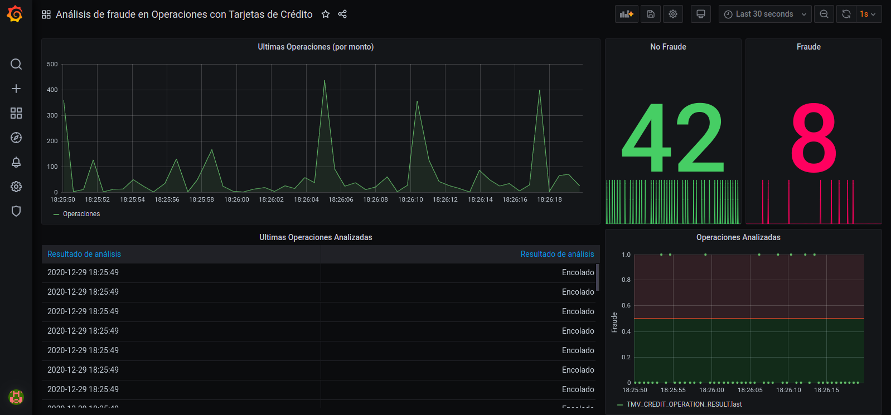

# Trabajo Final Integrador de Aprendizaje Automático II

Este trabajo es la continuación del [Trabajo Final Integrador de Machine Learning 1](https://github.com/nhorro/ceai2020/tree/master/machine_learning_1/trabajo_integrador) e incorpora lo siguiente:

- **Arquitectura de microservicios**: 
  - Se agrega una cadena de procesamiento de detección de anomalías en tiempo real utilizando:
    - Un servicio que publica datos periódicamente. Por no disponer de datos reales, en este caso es un "mock" que publica muestras del test set elegidas aleatoriamente (actualizando la fecha de cada nueva muestra generada a la hora actual).
    - El servicio Kapacitor como sistema de monitoreo y alerta en tiempo real configurado para comunicarse con UDF (User Defined Functions) por medio de sockets.
    - Un servicio que implementa la API de UDF de Kapacitor por socket para conectarlo con modelos propios.
  - Se incorpora Cronograf como administrador de tareas de Kapacitor.
  - Se incluye tensorflow-serving para servir modelos basados en Tensorflow/Keras y un ejemplo de comunicación del servicio UDF de Kapacitor con este último.
- **Manejo de datos imbalanceados**: se aplican técnicas de [SMOTE: Synthetic Minority Over-sampling Technique](https://arxiv.org/pdf/1106.1813.pdf) utilizando la librería [imbalanced-learn](https://imbalanced-learn.org) para mejorar el tratamiento de los datos imbalanceados.
- **Hyperparameter Tuning**: 
  - Se reemplaza el mecanismo ad-hoc de búsqueda de parámetros.
- **Modelos de Ensamble**: 
  - Se incorporan modelos de ensamble que utilizan distintas técnicas: Bagging, Boosting y Stacking.
- **Otros**: eliminación de código ad-hoc que se puede resolver con los métodos de librerías standard (ejemplo, uso de Pipelines de SKLearn).

## Contenido

[TOC]

## Descripción general y alcance

Este trabajo propone una solución sencilla de un ambiente autocontenido para prototipado de modelos de Machine Learning en lenguaje Python basada en microservicios con docker-compose.  El foco está en poder ejercitar el proceso completo desde el desarrollo de modelos hasta su puesta en producción con fines didácticos, de prueba de concepto o académicos. Por lo tanto, hay muchos aspectos que están simplificados y no se pone atención a gestión de usuarios y permisos, performance, redundancia, disponibilidad, escalabilidad, etc. y no es apto para producción.

### Diagrama de componentes de alto nivel


Organización de directorios:

~~~
./	
	compose					Configuración de servicios docker-compose.
		api                 API para servicio de modelos (basada en Flask).
	data 					Datos originales en CSV (fuente: Kaggle).
	notebooks				Notebooks para desarrollo de modelos.
		tmp         		Archivos temporales, diagramas generados, etc.	
	docker-compose.yml      Archivo de configuración de docker-compose.	
	models 					Modelos entrenados para uso en producción.
	README.md 				Este archivo.
~~~


### Microservicios

- Jupyter(/lab) como ambiente de desarrollo y evaluación de modelos.
- ElasticSearch como base de datos orientada a eventos/documentos.
- Grafana y Kibana como interfaces para administración y monitoreo.
- Una plantilla en Flask para servicio de modelos con API REST.
- Portainer para administración de containers.

## Instrucciones

### Ejecución

Cear el directorio para el socket de comunicación utilizado por Kapacitor y el servicio de UDF:

```mkdir /tmp/comm```

Para iniciar los servicios cambiar al directorio compose y ejecutar:
```./up.sh ```

Para apagar los servicios, en el mismo directorio ejecutar:
```./down.sh```

#### Configuración por defecto

Los servicios COTS están configurados por defecto siguiendo las guías provistas de cada fabricante. 

| Servicio      | Parámetros                                                   | Observaciones                                                |
| ------------- | ------------------------------------------------------------ | ------------------------------------------------------------ |
| Elasticsearch | Puertos: 9200/9300                                           | Ver: https://www.elastic.co/guide/en/elasticsearch/reference/current/docker.html |
| Jupyterlab    | URL: http://localhost:10000<br/>                             | Basada en jupyter/scipy-notebook. Ver: https://jupyter-docker-stacks.readthedocs.io/en/latest/using/selecting.html#jupyter-scipy-notebook |
| Grafana       | URL: http://localhost:3000/<br/>User: admin<br/>Password: admin | Ver: https://grafana.com/docs/grafana/latest/installation/docker/ |
| Kibana        | URL: http://localhost:5601/                                  | Ver: https://www.elastic.co/guide/en/kibana/current/docker.html |
| API con Flask | Configuración para desarrollo.<br />URL: http://localhost:5000/ | Ver contenido de directorio ./compose/api.                   |

Si se accede desde otro host, recordar configurar el firewall. Por ejemplo, en Ubuntu:

```bash
# Jupyter
sudo firewall-cmd --add-port=10000/tcp --permanent
# Grafana
sudo firewall-cmd --add-port=3000/tcp --permanent
# Kibana
sudo firewall-cmd --add-port=5601/tcp --permanent
# API c/ Flask
sudo firewall-cmd --add-port=5000/tcp --permanent
sudo firewall-cmd --reload
```

#### Setup inicial / guía de uso

La primera vez que se ejecuta el compose, se descargarán las imágenes e instanciarán los containers. Las bases de datos estarán vacías.  Se deben seguir estos pasos para cargar las bases de datos y poner un modelo de ejemplo en producción.

1. Conectarse a Jupyter.
2. Abrir y ejecutar los siguientes notebooks en orden, siguiendo las instrucciones de cada uno:
   - [01 - Setup.ipynb](http://localhost:10000/notebooks/01 - Setup.ipynb)
   - [02 - Model Development.ipynb](http://localhost:10000/notebooks/02 - Model Development.ipynb)
   - [03 - API Usage Example.ipynb](http://localhost:10000/notebooks/03 - API Usage Example.ipynb)
3. Una vez cargados los datos, es posible inspeccionarlos en Grafana y Kibana, además de hacer predicciones consumiendo la API REST.



